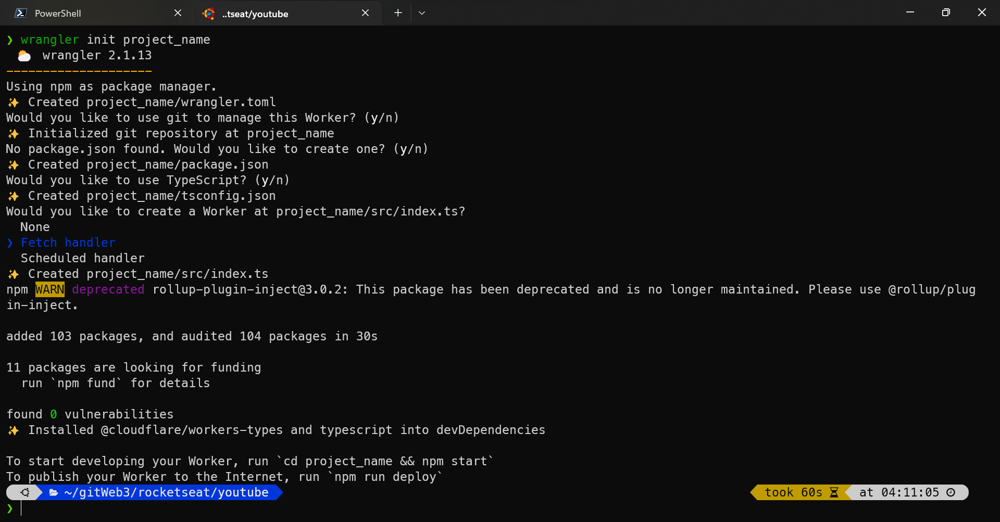
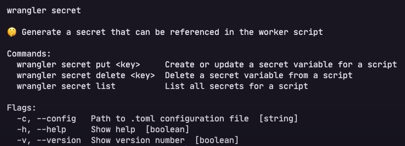

# EDGE COMPUTING | Serverless Tests

Category: Youtube<br>
Created time: October 28, 2022 3:24 AM<br>
Source: Rocketseat<br>
Tags: Serverless, Upstash, Wangler, Workers<br><br>

<a href="https://youtu.be/dcFoLL8Po_o" >
  
  <p>Source Rocketseat</p>
</a><br>

## Description

Unlike the traditional cloud, edge computing makes the user activate the closest server during their access.<br><br>

**Deploy serverless**<br>
[Cloudflare Workers®](https://workers.cloudflare.com/)<br>

**Serverless Database Platform**<br>
[Upstash: Serverless Data for Redis® and Kafka®](https://upstash.com/)<br><br>

## Installations<br><br>

### Wrangler [Cloudflare Workers]<br>

[Runtime APIs · Cloudflare Workers docs](https://developers.cloudflare.com/workers/runtime-apis/)<br>

\*As global

```bash
npm i -g wrangler
```

Start a new project

```bash
wrangler init project_name
```



Running

```bash
# running on cloud [Localhost is just a proxy]
npm run start

# runnig ONLY localhost [without cloud]
npm run local

# Publish project
npm run deploy
```

```json
"scripts": {
    "start": "wrangler dev",
		"local": "wrangler dev --local", //added [it's NOT default]
    "deploy": "wrangler publish"
  }
```

### Upstash [S**erverless Database**]

- First create a account e a new database as global
- REST API infos: `@Upstash/redis`
  `UPSTASH_REDIS_REST_URL` <br>
  `UPSTASH_REDIS_REST_TOKEN`

### Dependencies

```bash
npm install @upstash/redis
npm install worktop
```

## Publish

```bash
npm run deploy
```

<aside>
⚠️ Remind to hide your `UPSTASH_REDIS_REST_TOKEN`

```bash
wrangler secret put UPSTASH_REDIS_REST_TOKEN
```



</aside><br><br>

## Orthers

[Announcing D1: first SQL database by Cloudflare](https://blog.cloudflare.com/introducing-d1/)

[PlanetScale | The MySQL-compatible serverless database platform](https://planetscale.com/)

[The edge cloud platform behind the best of the web](https://www.fastly.com/)

[Deno Deploy](https://deno.com/deploy)

[Develop. Preview. Ship. For the best frontend teams - Vercel](https://vercel.com/)
